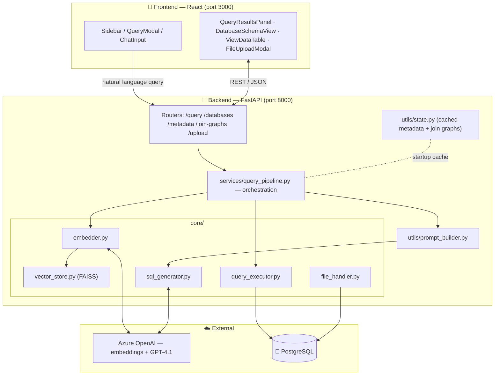
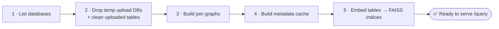
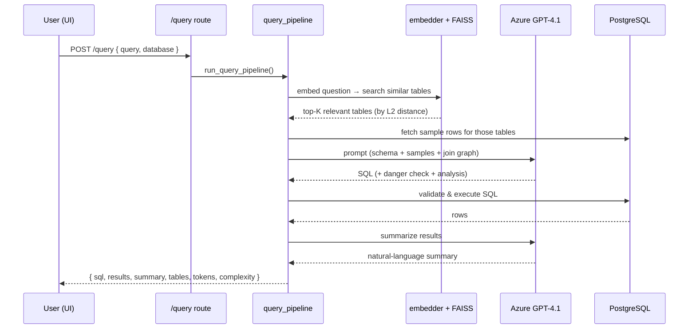

# Text-to-SQL 🗣️ ➡️ 📊

Convert natural-language questions into SQL, run them against PostgreSQL, and get
back results plus an AI-written summary. Tables are retrieved by **semantic search**
(FAISS + Azure OpenAI embeddings), SQL is generated by an LLM (Azure GPT‑4.1), and
the React UI lets you query, browse schemas, view data, and upload CSV/Excel files.

- **Frontend:** React 18 (Create React App) — http://localhost:3000
- **Backend:** FastAPI + Uvicorn — http://localhost:8000 (Swagger docs at `/docs`)
- **AI:** Azure OpenAI (embeddings + chat), FAISS vector index, LangChain
- **Database:** PostgreSQL

---

## Table of Contents
1. [Architecture & Data Flow](#architecture--data-flow)
2. [How a Query Works (step by step)](#how-a-query-works-step-by-step)
3. [Module Reference](#module-reference)
4. [Prerequisites](#prerequisites)
5. [Installation](#installation)
6. [Configuration (.env.local)](#configuration-envlocal)
7. [Running the App](#running-the-app)
8. [API Endpoints](#api-endpoints)
9. [Project Structure](#project-structure)
10. [Troubleshooting](#troubleshooting)

---

## Architecture & Data Flow



### Startup sequence (FastAPI lifespan)


---

## How a Query Works (step by step)

When you submit a question, `services/query_pipeline.py` runs this pipeline:



1. **Embed & retrieve** – The question is embedded; FAISS returns the most similar
   tables (schema tables *and* uploaded tables share the same index).
2. **Gather context** – Metadata + a few real sample rows per table are collected so
   the LLM can reason about actual values, not just column names.
3. **Generate SQL** – `prompt_builder.py` builds the prompt; the LLM returns SQL,
   a danger flag (blocks DELETE/DROP/UPDATE/INSERT), and a one-line analysis.
4. **Validate & execute** – `query_executor.py` validates then runs the SQL (read‑only).
5. **Summarize** – A second LLM call writes a concise summary of the result set.
6. **Respond** – SQL, rows, summary, tables used, token count, and complexity rating.

---

## Module Reference

| Path | Responsibility |
|------|----------------|
| `backend/main.py` | Entry point. Starts **backend + frontend together** (see [Running](#running-the-app)). |
| `backend/app.py` | FastAPI app, CORS, router registration, startup/shutdown lifespan. |
| **config/** | |
| `config/azure_client.py` | Sync/async Azure OpenAI clients for embeddings. |
| `config/llm.py` | LangChain `AzureChatOpenAI` (GPT‑4.1) for SQL + summaries. |
| **routes/** | |
| `routes/query.py` | `POST /query`, `GET /query/search-tables`. |
| `routes/databases.py` | List DBs, create DB, list tables, table schema/data. |
| `routes/metadata.py` | Cached metadata for all/one database. |
| `routes/join_graphs.py` | Foreign-key join graphs for all/one database. |
| `routes/upload.py` | Upload CSV/Excel, list/delete uploaded tables. |
| **services/** | |
| `services/query_pipeline.py` | Orchestrates the whole NL→SQL→results→summary flow. |
| **core/** | |
| `core/embedder.py` | Embeds tables, runs semantic search, reconciles uploaded tables. |
| `core/vector_store.py` | FAISS index build / persist / search. |
| `core/sql_generator.py` | Calls the LLM, parses SQL + danger flag. |
| `core/query_executor.py` | Validates and executes SQL, fetches sample rows. |
| `core/file_handler.py` | Parses CSV/Excel, creates `uploaded__*` tables. |
| **utils/** | |
| `utils/prompt_builder.py` | Builds the SQL-generation prompt (schema + samples + joins). |
| `utils/metadata_builder.py` | Introspects PostgreSQL into metadata. |
| `utils/join_graph_builder.py` | Derives FK relationships / join paths. |
| `utils/state.py` | In-memory cache of metadata + join graphs. |
| `utils/db_registry.py` | Tracks DBs created via upload so they can be dropped on restart. |
| `utils/logger.py` | Query logging + log cleanup. |
| **db/** | |
| `db/db.py` | SQLAlchemy engine factory (per-database connections). |
| `db/db_models.py` | Pydantic request/response models (`QueryRequest`, `QueryResponse`). |
| **frontend/src/components/** | |
| `layout/Sidebar.js` | Navigation + upload trigger. |
| `query/*` | `QueryModal`, `ChatInput`, `ChatMessage`, `QueryResultsPanel`. |
| `schema/DatabaseSchemaView.js` | Browse table structures. |
| `data/ViewDataTable.js` | Browse raw table data. |
| `upload/FileUploadModal.js` | Drag-and-drop multi-file upload. |

---

## Prerequisites

| Tool | Version | Notes |
|------|---------|-------|
| **Python** | 3.10+ | 3.10–3.12 recommended. |
| **Node.js + npm** | Node 16+ | Needed for the React frontend. |
| **PostgreSQL** | 12+ | Running locally and reachable. |
| **Azure OpenAI** | — | An endpoint + key with a chat deployment (`gpt-4.1`) and an embeddings deployment (`text-embedding-3-small`). |

---

## Installation

### 1. Enter the project
```powershell
cd c:\Users\gangwarr\Documents\TextToSQL
```

### 2. Create & activate a Python virtual environment
```powershell
python -m venv .venv
.\.venv\Scripts\Activate.ps1
```
> If activation is blocked, run once:
> `Set-ExecutionPolicy -Scope Process -ExecutionPolicy RemoteSigned`

### 3. Install Python dependencies
```powershell
pip install -e .
```
This installs everything from `pyproject.toml` (FastAPI, Uvicorn, SQLAlchemy,
psycopg2, LangChain, langchain-openai, faiss-cpu, numpy, python-dotenv, …).

### 4. Install frontend dependencies
```powershell
cd frontend
npm install
cd ..
```

---

## Configuration (.env.local)

Create a file named **`.env.local`** in the project root. **Do not commit it** —
it holds secrets.

```env
# ===== PostgreSQL =====
DB_HOST=localhost
DB_PORT=5432
DB_USER=postgres
DB_PASSWORD=your_postgres_password
DB_NAME=Sample

# ===== FastAPI =====
API_HOST=0.0.0.0
API_PORT=8000
ENVIRONMENT=development

# ===== Azure OpenAI =====
AZURE_OPENAI_ENDPOINT="https://YOUR-RESOURCE.openai.azure.com/"
AZURE_OPENAI_API_KEY="YOUR_AZURE_OPENAI_KEY"
AZURE_OPENAI_API_VERSION="2025-01-01-preview"

# ===== Embeddings =====
EMBEDDING_MODEL=text-embedding-3-small
```


---

## Running the App

### Option A — One command (recommended)
`backend/main.py` starts **both** the FastAPI backend *and* the React frontend.

```powershell
.\.venv\Scripts\python.exe .\backend\main.py
```

- Backend → http://localhost:8000  (API docs: http://localhost:8000/docs)
- Frontend → http://localhost:3000

Press **Ctrl+C** to stop; the frontend child process is shut down automatically.

**Backend only:** set `RUN_FRONTEND=0` first:
```powershell
$env:RUN_FRONTEND=0; .\.venv\Scripts\python.exe .\backend\main.py
```

### Option B — Run each separately (two terminals)
```powershell
# Terminal 1 — backend (RUN_FRONTEND=0 to skip auto-starting the UI)
$env:RUN_FRONTEND=0; .\.venv\Scripts\python.exe .\backend\main.py

# Terminal 2 — frontend
cd frontend
npm start
```

### Option C — npm scripts (from project root)
```powershell
npm run start        # backend + frontend via concurrently
npm run backend      # backend only
npm run frontend     # frontend only
```

> **Ports busy?** Free 8000/3000 first:
> ```powershell
> 8000,3000 | ForEach-Object { (Get-NetTCPConnection -LocalPort $_ -State Listen -EA SilentlyContinue).OwningProcess } |
>   Sort-Object -Unique | ForEach-Object { Stop-Process -Id $_ -Force -EA SilentlyContinue }
> ```

---

## API Endpoints

Base URL: `http://localhost:8000` · Interactive docs: `/docs`

### Query
| Method | Path | Description |
|--------|------|-------------|
| `POST` | `/query` | Natural language → SQL → results + summary. |
| `GET`  | `/query/search-tables` | Semantic table search for a query. |

**`POST /query`**
```json
// request
{ "query": "give me the top 5 customers by total spend", "database": "fastapi_db" }
```
```json
// response (shape)
{
  "query": "...",
  "sql": "SELECT ...",
  "results": [ { "...": "..." } ],
  "summary": "Concise AI summary of the rows.",
  "tables": ["customers", "orders"],
  "joinPath": "...",
  "tokensUsed": "1472",
  "executionTime": "850ms",
  "complexity": "Moderate"
}
```

### Databases
| Method | Path | Description |
|--------|------|-------------|
| `GET`  | `/databases` | List all databases. |
| `POST` | `/databases` | Create a new database. |
| `GET`  | `/databases/{db}/tables` | Tables in a database. |
| `GET`  | `/databases/{db}/tables/{table}/schema` | Column/type/constraint details. |
| `GET`  | `/databases/{db}/tables/{table}/data` | Raw table rows. |

### Metadata & Join Graphs
| Method | Path | Description |
|--------|------|-------------|
| `GET`  | `/metadata` | Cached metadata for all databases. |
| `GET`  | `/metadata/{db}` | Metadata for one database. |
| `GET`  | `/join-graphs` | FK join graphs for all databases. |
| `GET`  | `/join-graphs/{db}` | Join graph for one database. |

### Upload
| Method | Path | Description |
|--------|------|-------------|
| `POST` | `/upload?database={db}` | Upload one or more CSV/Excel files (field name `files`). |
| `GET`  | `/upload/tables?database={db}` | List uploaded tables. |
| `DELETE` | `/upload/tables/{table_name}?database={db}` | Delete an uploaded table. |

> Uploaded files become tables prefixed `uploaded__`. They are embedded into the
> same FAISS index so they're retrievable by semantic search just like schema tables.

### Quick test (cURL)
```bash
curl http://localhost:8000/databases
curl -X POST http://localhost:8000/query \
  -H "Content-Type: application/json" \
  -d "{\"query\":\"list all customers\",\"database\":\"fastapi_db\"}"
```

---

## Project Structure

```
TextToSQL/
├── backend/                    # Python package (importable as `backend`)
│   ├── main.py                 # Entry point — starts backend + frontend
│   ├── app.py                  # FastAPI app, CORS, lifespan, routers
│   ├── paths.py                # Centralized runtime paths (data/ locations)
│   ├── config/                 # azure_client.py, llm.py
│   ├── core/                   # embedder, vector_store, sql_generator,
│   │                           #   query_executor, file_handler
│   ├── db/                     # db.py (engine), db_models.py (schemas)
│   ├── routes/                 # query, databases, metadata, join_graphs, upload
│   ├── services/               # query_pipeline.py (orchestration)
│   └── utils/                  # prompt_builder, metadata_builder,
│                               #   join_graph_builder, state, db_registry, logger
├── frontend/
│   ├── public/
│   ├── src/
│   │   ├── App.js
│   │   ├── index.css           # design tokens / theme
│   │   └── components/         # layout, query, schema, data, upload, common
│   └── package.json
├── data/                       # runtime artifacts (git-ignored, auto-created)
│   ├── embeddings/             # persisted FAISS indices + metadata json
│   ├── logs/                   # query logs
│   └── created_databases.json  # temporary-DB registry
├── pyproject.toml              # Python package + dependencies (pip install -e .)
├── package.json                # root npm scripts (concurrently)
├── .venv/                      # Python virtual environment (git-ignored)
├── .env.local                  # secrets (git-ignored — create this yourself)
└── README.md
```


---

## Troubleshooting

| Symptom | Fix |
|---------|-----|
| `Port 8000/3000 in use` | Kill the listeners (see the snippet under [Running](#running-the-app)). A stale uvicorn `multiprocessing-fork` child can hold 8000 even after the parent dies — kill that child PID too. |
| Frontend didn't start from `main.py` | Ensure `npm` is on PATH and `frontend/node_modules` exists (`cd frontend && npm install`). The backend still runs without it. |
| `UnicodeEncodeError` printing emoji | The console is cp1252. Run with UTF‑8: `$env:PYTHONUTF8=1; $env:PYTHONIOENCODING="utf-8"`. |
| `python` opens Microsoft Store | Use the venv interpreter: `.\.venv\Scripts\python.exe`. |
| 401 / auth errors from Azure | Check `AZURE_OPENAI_ENDPOINT`, `AZURE_OPENAI_API_KEY`, `AZURE_OPENAI_API_VERSION`, and that your deployments are named `gpt-4.1` and `text-embedding-3-small`. |
| `connection refused` / DB connection fails | Verify PostgreSQL is running on `localhost:5432` and `DB_*` values in `.env.local` are correct. |
| `password authentication failed` | Check `DB_USER` / `DB_PASSWORD` in `.env.local`. |
| Uploaded tables vanished after restart | DBs created via upload are tracked in `created_databases.json` and dropped on startup by design. Upload into an existing database to persist. |
| `name 'Path' is not defined` when uploading a file | `backend/routes/upload.py` must import `Path` (`from pathlib import Path`). This is included by default; if you see it, confirm the import is present. |
| CRA asks to use another port | Port 3000 is busy — answer `Y` to use the next free port, or free 3000 first. |

---

## Notes
- The backend runs with **auto-reload** (`reload=True`) — edits to backend code
  restart the server automatically.
- Editing frontend code hot-reloads in the browser.
- SQL generation is **read-only**: destructive operations (DELETE/DROP/UPDATE/INSERT)
  are detected and blocked, never executed.

---

**Created with ❤️ for SQL enthusiasts**
